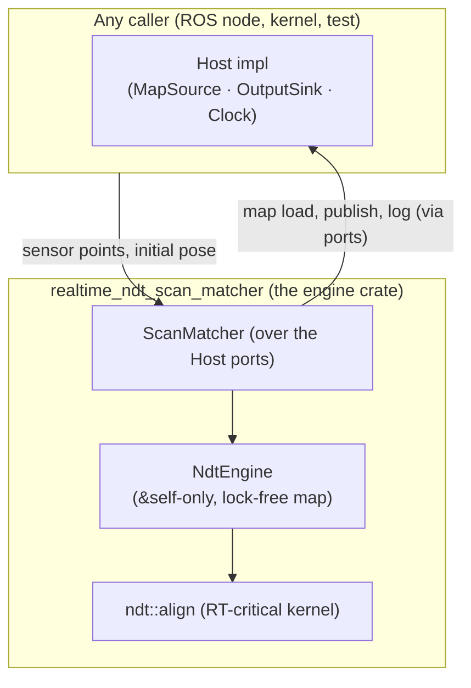

# Introduction

This book documents the **`realtime_core` workspace** — the ROS-free, `no_std`-capable Rust ports
of Autoware Core localization components, with the **NDT engine crate** at its heart. It is
written for the people who build on, review, and maintain the *algorithms*: the engine, the align
hot path, the covariance/pose search, and the real-time / `no_std` guarantees.

The workspace holds four crates, and this book has a part for each:

| Crate | Contents | C++ counterpart |
|---|---|---|
| `realtime_localization_util` | `pose_buffer` (the `SmartPoseBuffer` port), `tpe` (the pose-search sampler), `transform` (SE3 kernels) | `autoware_localization_util` |
| `realtime_kdtree` | bounded radius-search kd-tree over voxel centroids | `pcl::KdTreeFLANN` (replacement) |
| `realtime_port_instrument` | deterministic WCET cost counters + the cross-language FNV/SHA trace ABI | the traced C++ analysis build (`realtime_ndt_scan_matcher/bench/traced`) |
| `realtime_ndt_scan_matcher` | the NDT engine, align kernel, voxel grid, covariance estimation, `Host` ports — the bulk of this book | `autoware_ndt_scan_matcher` (its algorithmic core) |

The engine crate re-exports the three sibling crates under its original module paths
(`pose_buffer`, `tpe`, `transform`, `wcet`), so consumer code and the module paths named in this
book resolve unchanged. Every path in this book is relative to the workspace root
(`realtime_core/`). All four crates hold **only** the portable algorithmic core — no
`extern "C"`, no `rclcpp`, no ROS message types. The C ABI and the ROS 2 node — the FFI boundary,
the `Host` vtable, the
ROS node shell, and the C++→Rust symbol map — live in a separate ROS node crate that consumes this
engine as a dependency; that integration is out of scope here.

## Why this workspace exists

- **Panic-free, WCET-bounded real time.** The align hot path is allocation-free after warmup,
  has a documented worst-case execution-time contract, and cannot panic.
- **A `no_std` / kernel target.** The same engine builds without `std`
  (`--no-default-features`), so it can run under a bare-metal kernel — the portability goal that
  shaped the whole design. The `mt` feature adds a multi-core, `Sync` engine.
- **Reusability.** Because the engine is ROS-free and pure Rust, it can be consumed directly by
  Rust callers (see the `realtime_ndt_scan_matcher/examples/` and `realtime_ndt_scan_matcher/tests/`) as well as by the ROS node over FFI.

## What is and isn't in scope

**In scope (this workspace):** the NDT engine and voxel-grid map, the align kernel, scores
(transform probability and nearest-voxel likelihood), covariance estimation, the align-service
pose search (TPE), pose buffers, the convergence verdict, and the `Host` port traits that let a
caller supply the map, clock, and output sink.

**Out of scope (the node crate / `rclcpp`):** the C ABI, ROS node construction,
publishers/subscribers/services/timers, parameter declaration, TF lookup, the map-loader service
call, and message publication. These crates never link `rclcpp` and never touch ROS types; a
caller drives them through the `Host` traits.

## The shape of the engine

Read [How to read this book](reader-map.md) next — it routes each kind of reader to the chapters
that matter most.
